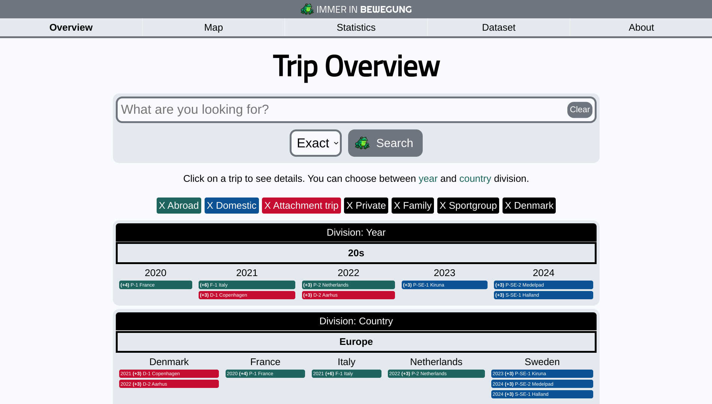
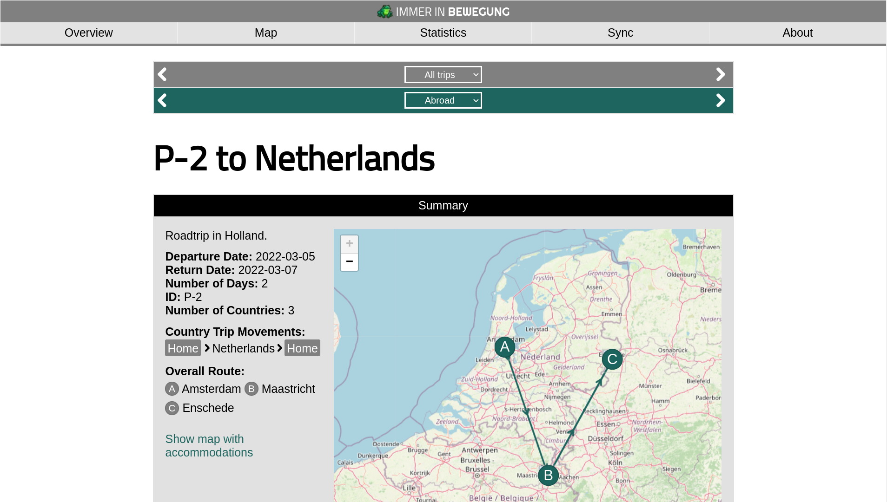

# Immer in Bewegung 
Open source travel documentation app for self-hosting with language support. English, Swedish, Danish, German, Dutch, or define your own.

## Installation instructions
See installation instructions at https://bewegung.app/docs/installation

## Overall information about the application
Read more at https://bewegung.app/

## Sreenshots

## Licenses
* Immer in Bewegung: AGPL-3.0 license
* Leaflet: BSD-2-Clause license
* Chartjs: MIT license
