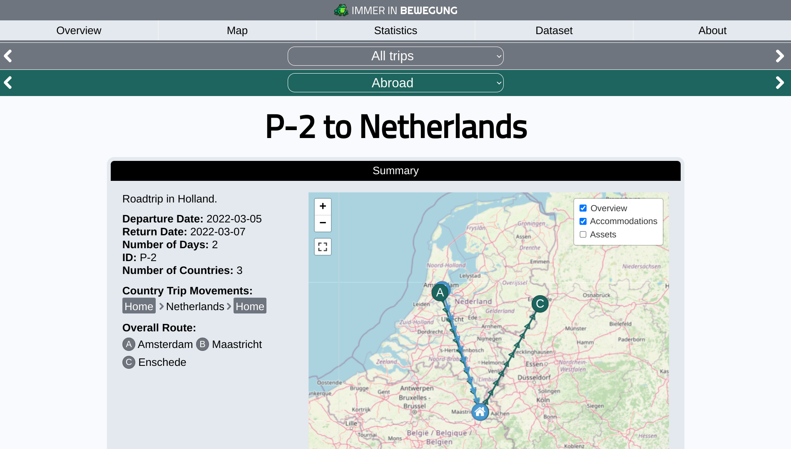

# Immer in Bewegung 
Open source travel documentation app for self-hosting

Available in
* 🇬🇧 English
* 🇸🇪 Swedish
* 🇩🇰 Danish
* 🇩🇪 German
* 🇳🇱 Dutch

or define your own language.

## Installation instructions
See installation instructions at https://bewegung.app/docs/installation

## Overall information about the application
Read more at https://bewegung.app/

## Online live demo
You can check out a demo app running at https://demo.bewegung.app/. Please note that the demo app has been converted to static files due to GitHub's limitations. As a result, **some functions may not display or behave exactly like they do in the real app (the maps and the search functions are not working in the demo)**.

## Sreenshots

## Licenses
* Immer in Bewegung: AGPL-3.0 license
* Leaflet: BSD-2-Clause license
* Chartjs: MIT license
