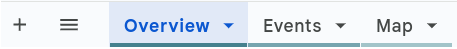
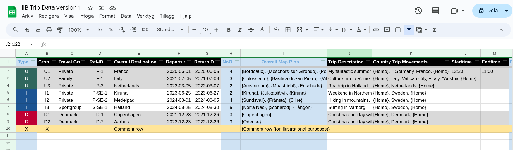

# Create the dataset

## Using pre-defined spreadsheet (Recommended)

Make a copy of the template below

:::tip[Pre-defined spreadsheeet]
[Google Sheet Spreadsheet Template](https://docs.google.com/spreadsheets/d/1I6WCPk-IyaqQA9brLZWTthpenYgaesTJGGYc8tliDPs/edit)
:::

Follow the instructions under Trip Syntax chapter to fill out the **three sheets** in the template.

:::danger[Beware]
The blue columns (shown in the image below) contain formulas and should not be manually edited.
:::

## Build your own spreadsheet (Not recommended)

**Step 1 − Create a spreadsheet**

Create a spreadsheet containing three (3) sheets named
- **Overview**
- **Events**
- **Map**

**Step 2 − Create columns**

Create columns in the sheets according to the trip syntax in next chapter.

**Step 3 − Save sheets to tsv**

When you are finished save all three sheets in tsv format in data folder.