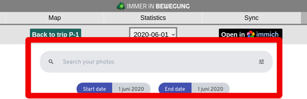

# Limitations

## Search bar shown in embedded photos
:::warning[Embedded photos from Immich in image view]
When Immer in Bewegung embeds photos in **image view** (see below), the search bar from Immich will be displayed unless you use a proxy pass with a sub-filter for your Immich installation. Hopefully, future releases of Immich will include an update allowing the search bar to be hidden via the Immich URL.
:::

**Temporary solution for Nginx**
Use sub-filters within the location tag in the Nginx site configuration file

`sub_filter '</head>' '</head>';`
